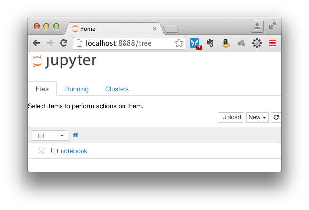
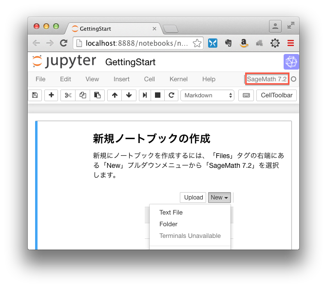
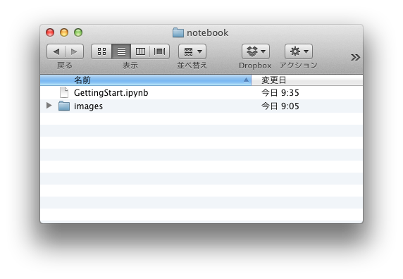

# 1. Vagrantを使ったSage jupyter環境の紹介

Sageでもjupyterのnotebookがスタンダードになり、Sageだけでなく、
Pandasやtheano等のpythonパッケージを使ったnotebookが増えてくると思います。

Vagrantを使って仮想マシンに構築したSageの紹介とこれまで作成したnotebookをjupyterに移植し、
紹介して行きます。また、必要なパッケージのインストール方法についても適宜説明します。

今回使用するVagrantの仮想マシン（Vagrantではboxと呼びます）の作成方法については、
以下のリンクで紹介しています。

- [Vagrantを使ったSage jupyter環境構築方法](vagrant/ReadMe.md)

# 2. 必要なアプリケーションのインストール

環境構築に必要なアプリケーションは、以下の２つです。
- VirtualBox: 無料で使用できるx86仮想化ソフトウェアです。Ubuntu14.04の仮想環境を実行するために使用します。<sup>[1](#note1)</sup>
- Vagrant: 仮想環境を構築し、実行するためのツールです。<sup>[2](#note2)</sup>

## 2.1. VirtualBoxのインストール


VirtualBoxは、以下のダウンロードサイトからお使いの環境に合わせてダウンロードし、インストールしてください。
- https://www.virtualbox.org/wiki/Downloads


## 2.2. Vagrantのインストール

Vagrant（ベイグラント）は、以下のダウンロードサイトからお使いの環境に合わせてダウンロードし、インストールしてください。
- https://www.vagrantup.com/downloads.html

# 3. SageMathのインストール
準備ができましたので、SageMathをVirtualBoxの仮想マシンで動くようにします。

## 3.1. vagrantファイルのダウンロード
Githubの以下のURLからjupyter用のnotebookとvagrant環境構築用ファイルをダウンロードします。

ターミナルソフトを起動し、以下のGitコマンドを使って必要なファイルをダウンロードします。
```bash
$ git clone https://github.com/take-pwave/jupyter.git
```
Gitでcloneを作った場合、ブランチを作成しておくと追加されたnotebookの取り込みが楽になります。

```bash
$ cd jupyter
$ git branch develop
$ git checkout develop
```

gitコマンドが使えない場合には、以下のURLの「Clone or download」をクリックし、Download ZIPを選択してください。
- https://github.com/take-pwave/jupyter

## 3.2. boxファイルのダウンロード
Vagrantには、自分の作成した仮想マシンをからboxファイルを作成するpackage機能が提供されています。
Ubuntu14.04にSageMathをインストールして、以下のパッケージを追加したboxを私の公開しているSage
サーバ（www15191ue.sakura.ne.jp）にアップしました。

私の公開しているSageMath環境には、以下のパッケージをインストールしています。

- pythonパッケージ
-- pandas 0.18.1


## 3.3. 仮想マシンの起動
jupyterをダウンロードしたディレクトリをDOWNLOAD_DIRとします。
ターミナルソフトを起動して、以下のコマンドを入力してください（$ の後のコマンドを入力）。

```bash
$ cd DOWNLOAD_DIR/MySageMath
$ vagrant up
```

Sageサーバからboxファイルがダウンロードされ、仮想マシンが起動します。

boxをダウンロードしている途中にtime outでエラーになった場合には、再度vagrant upを実行すると
以前ダウンロードしたファイルに追加して処理します。

3.81GBのファイルをダウンロードするため、完了するまでかなり時間が掛かります。

ダウンロードが終わり、仮想マシンが起動すると以下の様な画面が表示されます。
```
==> default: Clearing any previously set network interfaces...
==> default: Preparing network interfaces based on configuration...
    default: Adapter 1: nat
==> default: Forwarding ports...
    default: 8888 (guest) => 8888 (host) (adapter 1)
    default: 22 (guest) => 2222 (host) (adapter 1)
==> default: Running 'pre-boot' VM customizations...
==> default: Booting VM...
==> default: Waiting for machine to boot. This may take a few minutes...
    default: SSH address: 127.0.0.1:2222
    default: SSH username: vagrant
    default: SSH auth method: private key
    default: Warning: Remote connection disconnect. Retrying...
==> default: Machine booted and ready!
==> default: Checking for guest additions in VM...
==> default: Mounting shared folders...
    default: /vagrant => /Users/take/proj/jupyter/MySageMath
==> default: Machine already provisioned. Run `vagrant provision` or use the `--provision`
==> default: flag to force provisioning. Provisioners marked to run always will still run.
```

## 3.4. 仮想マシンの停止
仮想マシンを終了するには、以下のコマンドを入力してください（$ の後のコマンドを入力）。

```bash
$ vagrant halt
```

## 4. SageMathを使ってみる
ブラウザーで以下のURLを開きます。
```
http://localhost:8888/
```

jupyterの初期画面が表示されます。



新しくノートブックを作成する場合には、ここで表示されているnotebookディレクトリ中で作成してください。

### 4.1. ノートブックを見る
ブラウザーに表示された「notebook」をクリックし、その中の「GettingStart.ipynb」をクリックしてください。

以下の様に「GettingStart」ノートブックの内容が表示されます。



File, Edit等のメニューが並んでいる右端には、現在実行しているカーネル（ここではSageMath 7.2）の種類が表示されます。
もしも現在稼働中のカーネルが異なっている場合には、「Kernel」→「Change kernel」メニューから「SageMath 7.2」を選択してください。


### 4.2. ノートブックファイルの場所
jupyterのnotebook内に作成されたファイルは、vagrantのファイル共有機能を使って仮想マシンを実行しているマシン（ホストマシン）のDOWNLOAD_DIR/MySageMath/notebookに保存されます。

作成したノートブックのバックアップやファイルの追加・削除もホストマシンで簡単にできます。




## 脚注
- <small id="note1">1: 私のMacOSは10.7.5と古いため、VirtualBoxのバージョンは4.3.12を使用。</small>
- <small id="note2">2: 今回使用したバージョンは1.8.4です。</small>
