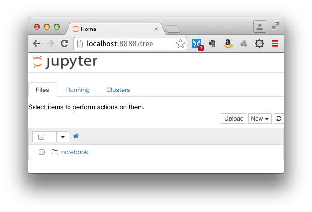
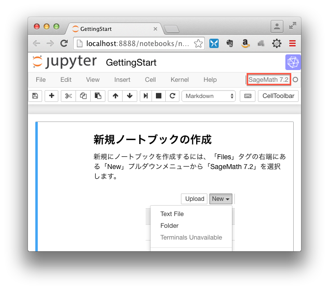
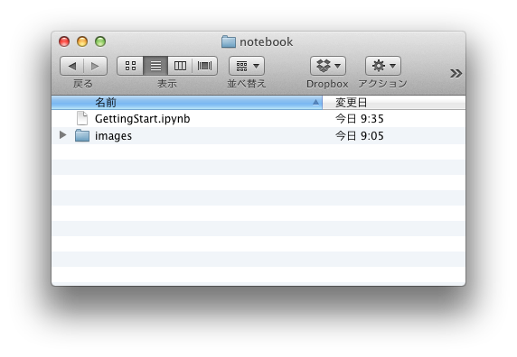

# 1. Vagrantを使ったSage jupyter環境構築

Sageでもjupyterのnotebookがスタンダードになり、Sageだけでなく、
Pandasやtheano等のpythonパッケージを使ったnotebookが増えてくると思います。

自分の紹介するnotebookを実行するのに必要な環境も含めて公開し、
誰でも同じ結果を得ることができるようにVagrantを使ってVirtualBoxのVM環境を構築する方法を紹介します。

# 2. 必要なアプリケーションのインストール

環境構築に必要なアプリケーションは、以下の２つです。
- VirtualBox: 無料で使用できるx86仮想化ソフトウェアです。Ubuntu14.04の仮想環境を実行するために使用します。<sup>[1](#note1)</sup>
- Vagrant: 仮想環境を構築し、実行するためのツールです。<sup>[2](#note2)</sup>

## 2.1. VirtualBoxのインストール


VirtualBoxは、以下のダウンロードサイトからお使いの環境に合わせてダウンロードし、インストールしてください。
- https://www.virtualbox.org/wiki/Downloads


## 2.2. Vagrantのインストール

Vagrant（ベイグラント）は、以下のダウンロードサイトからお使いの環境に合わせてダウンロードし、インストールしてください。
- https://www.vagrantup.com/downloads.html

# 3. SageMathのインストール
準備ができましたので、SageMathをVirtualBoxの仮想マシンで動くようにします。

## 3.1. vagrantファイルのダウンロード
Githubの以下のURLからjupyter用のnotebookとvagrant環境構築用ファイルをダウンロードします。

ターミナルソフトを起動し、以下のGitコマンドを使って必要なファイルをダウンロードします。
```
$ git clone https://github.com/take-pwave/jupyter.git
```

gitコマンドが使えない場合には、以下のURLの「Clone or download」をクリックし、Download ZIPを選択してください。
- https://github.com/take-pwave/jupyter

## 3.2. boxファイルのダウンロード
次に、SageをインストールするUbuntu14.04のboxファイルをダウンロードします。ダウンロードされたboxは、~/.vagrant.d/boxes/に保存されます。


```bash
$ vagrant box add SageMath7.2 https://cloud-images.ubuntu.com/vagrant/trusty/current/trusty-server-cloudimg-amd64-vagrant-disk1.box
```

## 3.3. 仮想マシンの起動
jupyterをダウンロードしたディレクトリをDOWNLOAD_DIRとします。
ターミナルソフトを起動して、以下のコマンドを入力してください。

```bash
$ cd DOWNLOAD_DIR/vagrant
$ vagrant up
```

仮想マシンが起動して、SageMath用のパッケージが自動的にダウンロードされ、セットされます。
1.5GB程度のファイルをダウンロードするため、完了すまでにはかなりの時間が掛かります。

インストール直後は、コンフィグ情報が正しくセットされないため、再度起動します。

```bash
$ vagrant reload
```

## 3.4. 仮想マシンの停止
仮想マシンを終了するには、以下のコマンドを入力してください。

```bash
$ vagrant halt
```

## 4. SageMathを使ってみる
ブラウザーで以下のURLを開きます。
```
http://localhost:8888/
```

jupyterの初期画面が表示されます。



新しくノートブックを作成する場合には、ここで表示されているnotebookディレクトリ中で作成してください。

### 4.1. ノートブックを見る
ブラウザーに表示された「notebook」をクリックし、その中の「GettingStart.ipynb」をクリックしてください。

以下の様に「GettingStart」ノートブックの内容が表示されます。



File, Edit等のメニューが並んでいる右端には、現在実行しているカーネル（ここではSageMath 7.2）の種類が表示されます。
もしも現在稼働中のカーネルが異なっている場合には、「Kernel」→「Change kernel」メニューから「SageMath 7.2」を選択してください。


### 4.2. ノートブックファイルの場所
jupyterのnotebook内に作成されたファイルは、vagrantのファイル共有機能を使って仮想マシンを実行しているマシン（ホストマシン）のDOWNLOAD_DIR/vagrant/notebookに作成されます。

作成したノートブックのバックアップやファイルの追加・削除もホストマシンで簡単にできます。



## 途中で失敗した場合

```bash
$ sudo sage -sh

(sage) $ exit
```

## 脚注
- <small id="note1">1: 私のMacOSは10.7.5と古いため、VirtualBoxのバージョンは4.3.12を使用。</small>
- <small id="note2">2: 今回使用したバージョンは1.8.4です。</small>
